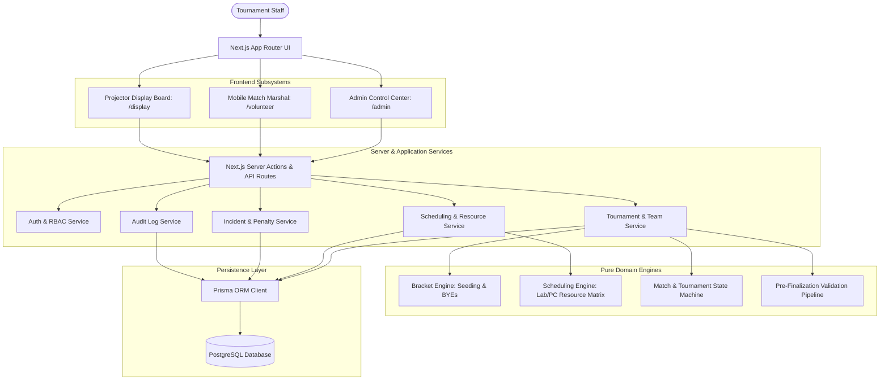

# System Architecture — VTO (VALORANT Tournament Operations System)

## 1. High-Level Overview
VTO is a dedicated LAN tournament operations platform engineered specifically for competitive VALORANT events held in university computing labs, esports arenas, and gaming centers.

---

## 2. Core Subsystems

### 2.1 Pure Domain Engines (`src/lib/`)
Zero dependency on Next.js, React, or database drivers. Pure, deterministic, easily testable logic:
1. **Bracket Engine (`src/lib/tournament/`)**:
   - Single Elimination, Round Robin, Group Stage + Knockout.
   - Standard competitive seeding (1 vs 2^k, 2 vs 2^k-1, etc.).
   - Deterministic BYE assignment to highest seeds.
   - Result advancement propagation to dependent bracket nodes.
2. **Scheduling Engine (`src/lib/scheduling/`)**:
   - Dynamic match capacity calculation: `capacity = sum(floor(working_pcs_in_lab / 10))` capped by configured stations.
   - Time-slot and station allocation with strict conflict avoidance.
   - Hard constraints: No double-booked teams, stations, or overlapping PC sets.
   - Soft constraints: Minimize wait time, balance lab usage, avoid back-to-back fatigue.
3. **State Transition Engine (`src/lib/tournament/state-machine.ts`)**:
   - Explicit finite state machines for Tournament and Match lifecycles.
   - Guard conditions preventing illegal transitions.
4. **Validation Pipeline (`src/lib/tournament/validator.ts`)**:
   - 10-point checklist before tournament finalization: team count, player completeness, station health, PC threshold, fixture validity, volunteer allocation.

### 2.2 Service Layer (`src/services/`)
Orchestrates operations, coordinates Prisma database transactions, and guarantees audit trail persistence:
- `tournament.service.ts`: CRUD, team management, bracket generation execution, finalization lock/unlock.
- `venue.service.ts`: Venues, labs, stations, PCs, real-time availability updates.
- `match.service.ts`: Match lifecycle operations (Call, Ready, Start, Pause, Score submission, Official verification, Forfeit).
- `attendance.service.ts`: Real-time roster verification, player check-in, substitution management.
- `incident.service.ts`: Incident ticket tracking, technical pause logging, penalty application.
- `audit.service.ts`: Immutable transaction logs with actor, entity, and diff snapshots.

### 2.3 User Interfaces
- **Admin Control Center (`/admin`)**:
  - Live Overview Dashboard with real-time stats and alerts.
  - Interactive Bracket Visualizer with zoom and match node drill-down.
  - Lab & Station Layout Designer with PC health indicators.
  - Fixture Generator & Timeline View.
  - Incident Desk & Audit Log Explorer.
- **Mobile Volunteer Portal (`/volunteer`)**:
  - Designed for smartphones held by marshals standing behind player booths.
  - Big 48px+ action buttons, low cognitive load.
  - One-tap Match Call, Start, Technical Pause, and Score Entry.
- **Public TV/Projector Display (`/display/:id`)**:
  - Full-screen high-contrast scoreboard and bracket tree.
  - Live station status (e.g. Lab 1 - Station 2: MAP 1 - T1 vs T2 [7-5]).
  - Read-only, zero administrative buttons.

---

## 3. Data Flow & Mutation Pipeline

```mermaid
sequenceDiagram
    autonumber
    actor Volunteer as Match Marshal
    actor Admin as Result Official
    participant App as Next.js Server Action
    participant Guard as RBAC & Zod Validator
    participant Service as MatchService
    participant Engine as BracketEngine
    participant DB as Prisma / Postgres
    participant Audit as AuditLog

    Volunteer->>App: submitMatchResult(matchId, scores, evidence)
    App->>Guard: Verify Marshal Role & Schema
    Guard-->>App: OK
    App->>Service: processResultSubmission()
    Service->>DB: Update Match (status: RESULT_PENDING)
    Service->>Audit: Log RESULT_SUBMITTED
    DB-->>Volunteer: Success (Awaiting Official Verification)

    Admin->>App: verifyMatchResult(matchId, verifiedScores)
    App->>Guard: Verify RESULT_OFFICIAL / SUPER_ADMIN Role
    Guard-->>App: OK
    App->>Service: verifyAndAdvanceWinner()
    rect rgb(20, 30, 45)
        Note over Service,DB: Executed in prisma.$transaction
        Service->>DB: Update Match (status: VERIFIED, winnerId)
        Service->>Engine: computeNextBracketNode(match, winnerId)
        Engine-->>Service: nextMatchId, slot (TeamA or TeamB)
        Service->>DB: Update Next Match (slot: winnerId)
        Service->>DB: Release Station & PCs (status: AVAILABLE)
        Service->>Audit: Log RESULT_VERIFIED & BRACKET_ADVANCED
    end
    DB-->>Admin: Success (Winner Advanced to Round 2)
```

---

## 4. Key Invariants & Safeguards
1. **No Phantom Advancements**: A match result can never propagate to the next round until an authorized Official verifies the result.
2. **Resource Reservation**: A station cannot host another match until its previous match is marked `FINISHED` or `CANCELLED`.
3. **Locking**: Once a tournament is `FINALIZED`, fixtures and team rosters cannot be modified without an explicit Super Admin unlock reason.
