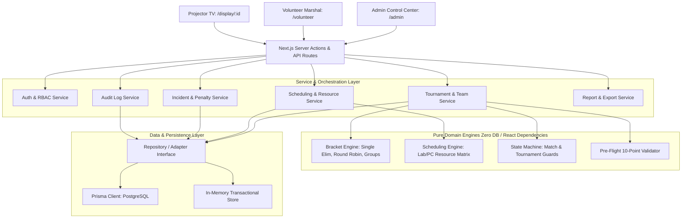

# System Architecture & Subagent Coordination — VTO

## 1. High-Level Architecture
VTO is an enterprise LAN tournament operations platform engineered specifically for competitive VALORANT events. It is structured into strict horizontal layers and vertical workstreams to allow parallel agent execution without file contention.

---

## 2. Multi-Agent Workstream Boundaries & File Ownership
To allow parallel subagents to operate concurrently without merge conflicts or overlapping edits, files and responsibilities are partitioned into **12 Independent Workstreams**:

| Workstream | Subagent Role | Primary File Ownership | Prohibited Edits |
|---|---|---|---|
| **WS1: Architecture & Contracts** | Lead Architect | `docs/*`, `GEMINI.md`, `src/types/` | Implementation files |
| **WS2: Database & Models** | Database Engineer | `prisma/schema.prisma`, `prisma/seed.ts` | UI components |
| **WS3: Tournament Engine** | Algorithm Engineer | `src/lib/tournament/bracket.ts`, `round-robin.ts`, `group-stage.ts` | DB queries, UI |
| **WS4: Scheduling Engine** | Resource Engineer | `src/lib/scheduling/capacity.ts`, `scheduler.ts`, `heuristics.ts` | UI, Auth |
| **WS5: State & Validation** | Integrity Engineer | `src/lib/tournament/state-machine.ts`, `validator.ts` | Database schema |
| **WS6: Backend Services & API**| Backend Engineer | `src/services/*`, `src/app/api/**` | UI JSX, CSS |
| **WS7: Admin Desktop UI** | Frontend Engineer | `src/app/(admin)/**`, `src/components/tournament/**` | Domain engine math |
| **WS8: Lab & Hardware UI** | Hardware UI Engineer | `src/components/venue/**`, `src/app/(admin)/admin/venues/**` | Fixture algorithms |
| **WS9: Mobile Volunteer Portal**| Mobile/UX Engineer | `src/app/volunteer/**`, `src/components/volunteer/**` | Desktop admin views |
| **WS10: Incidents & Penalties** | Operations Lead | `src/components/operations/incident-desk.tsx`, `src/services/incident.service.ts` | Lab hardware grids |
| **WS11: TV Display & Exports** | Media & Reports Engineer| `src/app/display/**`, `src/services/export.service.ts` | Live control toggles |
| **WS12: QA & Verification** | QA & Simulation Auditor| `tests/**`, `scripts/simulate-tournament.ts` | Production core logic |

---

## 3. Data Mutation Flow & Concurrency Controls
1. **Zero UI Mutation Logic**: UI components must never perform score calculations, seed placements, or capacity divisions directly. All state transitions must flow through API route handlers and domain engines.
2. **Audit Guarantee**: Every state alteration generates an immutable audit record containing:
   - `actorId` and `actorRole`
   - `action` (e.g. `MATCH_PAUSED`, `RESULT_VERIFIED`, `PC_OFFLINE`)
   - `entity` and `entityId`
   - `details` (human readable summary + structured diff)
   - `timestamp` (ISO 8601 UTC)
3. **Locking Invariant**: When a tournament transitions to `FINALIZED`, bracket regeneration and fixture rescheduling endpoints are hard-blocked by `validateTournamentTransition` unless accompanied by an authorized Super Admin unlock reason.
