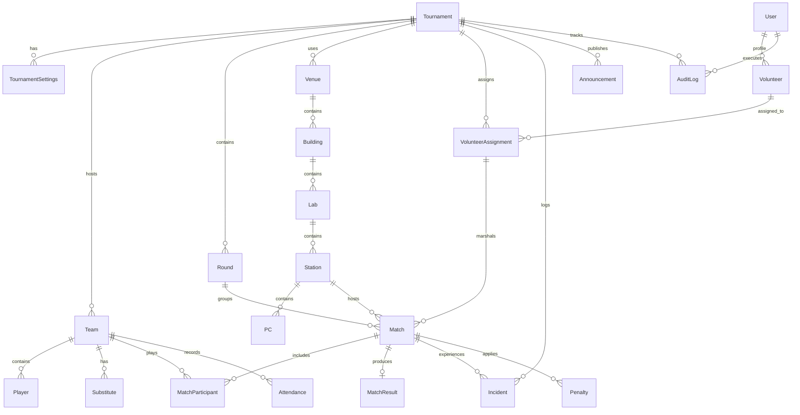

# Database Schema & Entity Relational Design — VTO

## 1. Overview
The persistence layer is backed by PostgreSQL via Prisma ORM. It enforces relational integrity, prevents cascading accidental data deletion of critical tournament fixtures, and records an immutable audit history.

---

## 2. Entity Relationship Diagram (ERD)



---

## 3. Data Dictionary & Entity Definitions

### 3.1 `Tournament`
- `id`: String (PK, CUID)
- `name`: String
- `game`: String (default: "VALORANT")
- `venueName`: String
- `date`: DateTime
- `startTime`: DateTime
- `status`: Enum (`DRAFT`, `READY`, `FINALIZED`, `LIVE`, `COMPLETED`, `ARCHIVED`)
- `format`: Enum (`SINGLE_ELIMINATION`, `ROUND_ROBIN`, `GROUP_STAGE_KNOCKOUT`)
- `currentRound`: Int (default: 1)
- `finalizedAt`: DateTime?
- `createdBy`: String (User ID)
- `createdAt`, `updatedAt`: DateTime

### 3.2 `TournamentSettings`
- `id`: String (PK, CUID)
- `tournamentId`: String (FK, Unique)
- `playersPerTeam`: Int (default: 5)
- `maxSubstitutes`: Int (default: 2)
- `matchDurationMinutes`: Int (default: 45)
- `bufferDurationMinutes`: Int (default: 15)
- `autoAdvanceBYEs`: Boolean (default: true)
- `requireCheckIn`: Boolean (default: true)
- `allowSelfRegistration`: Boolean (default: false)

### 3.3 `Team`
- `id`: String (PK, CUID)
- `tournamentId`: String (FK)
- `name`: String
- `captain`: String
- `captainContact`: String
- `institution`: String
- `seed`: Int?
- `status`: Enum (`REGISTERED`, `CHECKED_IN`, `INCOMPLETE`, `READY`, `PLAYING`, `QUALIFIED`, `ELIMINATED`, `DISQUALIFIED`, `NO_SHOW`)
- `checkedInAt`: DateTime?
- `createdAt`, `updatedAt`: DateTime

### 3.4 `Player` & `Substitute`
- `id`: String (PK, CUID)
- `teamId`: String (FK)
- `name`: String
- `collegeId`: String?
- `riotId`: String
- `riotTag`: String
- `phone`: String? (Encrypted / restricted)
- `role`: Enum (`CAPTAIN`, `STARTER`, `SUBSTITUTE`)
- `verified`: Boolean (default: false)
- `present`: Boolean (default: false)

### 3.5 `Venue`, `Building`, `Lab`, `Station`, `PC`
- **`Lab`**:
  - `id`: String (PK, CUID)
  - `venueId`: String (FK)
  - `name`: String
  - `totalPcs`: Int
  - `isActive`: Boolean (default: true)
- **`Station`**:
  - `id`: String (PK, CUID)
  - `labId`: String (FK)
  - `name`: String (e.g. "Station 1", "Station Alpha")
  - `pcCount`: Int (standard: 10)
  - `isActive`: Boolean (default: true)
- **`PC`**:
  - `id`: String (PK, CUID)
  - `stationId`: String? (FK)
  - `labId`: String (FK)
  - `pcNumber`: String
  - `ipAddress`: String?
  - `status`: Enum (`AVAILABLE`, `ASSIGNED`, `IN_USE`, `OFFLINE`, `MAINTENANCE`, `TECHNICAL_ISSUE`, `RESERVED`)
  - `notes`: String?

### 3.6 `Round` & `Match`
- **`Round`**:
  - `id`: String (PK, CUID)
  - `tournamentId`: String (FK)
  - `roundNumber`: Int
  - `name`: String (e.g. "Round of 16", "Quarterfinals", "Semifinals", "Grand Finals")
  - `status`: Enum (`PENDING`, `IN_PROGRESS`, `COMPLETED`)
- **`Match`**:
  - `id`: String (PK, CUID)
  - `roundId`: String (FK)
  - `matchNumber`: Int
  - `code`: String (e.g. "M01", "QF1")
  - `stationId`: String? (FK)
  - `scheduledStartTime`: DateTime?
  - `estimatedEndTime`: DateTime?
  - `actualStartTime`: DateTime?
  - `actualEndTime`: DateTime?
  - `status`: Enum (`SCHEDULED`, `CALLED`, `READY`, `LOBBY_READY`, `LIVE`, `PAUSED`, `FINISHED`, `RESULT_PENDING`, `VERIFIED`, `CANCELLED`, `FORFEIT`)
  - `teamAId`: String? (FK)
  - `teamBId`: String? (FK)
  - `winnerId`: String? (FK)
  - `loserId`: String? (FK)
  - `nextMatchId`: String? (FK, points to next round match)
  - `nextMatchSlot`: Enum? (`TEAM_A`, `TEAM_B`)
  - `isBye`: Boolean (default: false)

### 3.7 `MatchResult`
- `id`: String (PK, CUID)
- `matchId`: String (FK, Unique)
- `teamAScore`: Int
- `teamBScore`: Int
- `submittedBy`: String (Volunteer User ID)
- `submittedAt`: DateTime
- `verifiedBy`: String? (Official User ID)
- `verifiedAt`: DateTime?
- `screenshotUrl`: String?
- `notes`: String?

### 3.8 `Incident` & `Penalty`
- `id`: String (PK, CUID)
- `tournamentId`: String (FK)
- `matchId`: String? (FK)
- `teamId`: String? (FK)
- `playerId`: String? (FK)
- `reportedBy`: String (FK)
- `category`: Enum (`TECHNICAL`, `CONDUCT`, `CHEATING`, `NETWORK`, `PC`, `AUDIO`, `ACCOUNT`, `LOBBY`, `LATE`, `OTHER`)
- `severity`: Enum (`LOW`, `MEDIUM`, `HIGH`, `CRITICAL`)
- `status`: Enum (`REPORTED`, `ACKNOWLEDGED`, `INVESTIGATING`, `RESOLVED`, `DISMISSED`)
- `description`: String
- `evidence`: String?
- `action`: Enum (`NO_ACTION`, `WARNING`, `ROUND_PENALTY`, `MATCH_FORFEIT`, `DISQUALIFICATION`)
- `resolutionNotes`: String?
- `resolvedAt`: DateTime?

### 3.9 `AuditLog`
- `id`: String (PK, CUID)
- `tournamentId`: String? (FK)
- `actorId`: String
- `actorRole`: String
- `action`: String
- `entity`: String
- `entityId`: String
- `beforeState`: String? (JSON)
- `afterState`: String? (JSON)
- `ipAddress`: String?
- `createdAt`: DateTime @default(now())

---

## 4. Key Constraints & Indexes
```prisma
// Example Prisma Index definitions
@@index([tournamentId, status])
@@index([roundId, status])
@@index([stationId, scheduledStartTime])
@@index([entity, entityId])
@@index([tournamentId, createdAt])
```
These indexes guarantee rapid sub-millisecond lookups for live match boards, volunteer rosters, and station scheduling checks.
