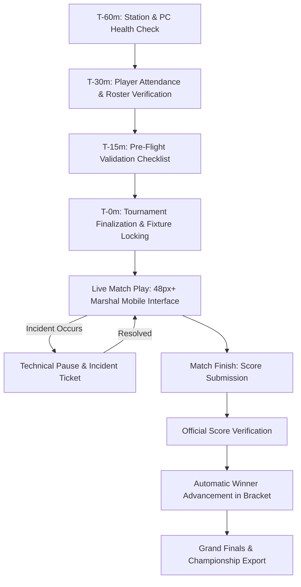

# Tournament Operations Runbook — VTO

## 1. Operations Lifecycle Overview

---

## 2. Standard Operating Procedures (SOP)

### SOP 1: Hardware Pre-Flight & Station Audit
1. Tech Lead walks the labs (e.g. Lab 1 with 30 PCs, Lab 2 with 10 PCs).
2. Verifies VALORANT client launched on all 40 PCs with Tournament Mode enabled and Vanguard active.
3. If any PC fails to boot, mark PC as `OFFLINE` on `/admin/venues`.
4. Verify that total operational stations match expected capacity (4 stations = 4 simultaneous matches).

### SOP 2: Team Registration & Check-In Desk
1. Registration Volunteer opens `/admin/teams`.
2. As captains arrive, verify physical college photo ID and Riot ID/Tag (`Name#Tag`).
3. If all 5 starting players are present, toggle `CHECKED IN`.
4. If a team has < 5 players, flag as `INCOMPLETE` (system displays warning).

### SOP 3: Pre-Flight Finalization & Locking
1. Tournament Director clicks **Validate & Finalize** on `/admin`.
2. System executes 10-point checklist:
   - Team count \(\ge 2\)
   - Complete 5-player rosters
   - Operational station capacity
   - Valid bracket DAG
   - Conflict-free fixtures
   - Volunteer staffing
3. Once all checks pass, Director clicks **Lock & Finalize Tournament**.
4. Fixtures and rosters are locked. Any subsequent edit requires Super Admin Unlock with mandatory audit rationale.

### SOP 4: Live Match Marshal Workflow (`/volunteer`)
1. Marshal arrives at assigned station.
2. Taps **Call Teams** \(\to\) Status: `CALLED`. Teams report to station.
3. Players sit at PCs, verify peripherals \(\to\) Marshal taps **Confirm Teams Seated** (Status: `READY`).
4. Custom 5v5 lobby created (Cheats OFF, Overtime: Win by 2, Tournament Mode ON).
5. Match begins \(\to\) Marshal taps **Start Match** (Status: `LIVE`).

### SOP 5: Incident Response & Technical Pause
1. In the event of network drop, peripheral failure, or client crash:
2. Marshal immediately taps **Tech Pause** (Status: `PAUSED`).
3. Marshal logs incident: Category (`PC`, `NETWORK`, `AUDIO`, `CONDUCT`), Severity (`LOW` to `CRITICAL`), description.
4. IT Technician hot-swaps hardware or re-establishes connection.
5. Tech Lead logs resolution note \(\to\) Marshal taps **Resume Match** (Status: `LIVE`).

### SOP 6: Score Submission & Verification
1. Match ends (13 rounds won by a team).
2. Marshal taps **Submit Result**, enters round scores (e.g. 13 - 9).
3. Match status transitions to `RESULT_PENDING`.
4. Head Tournament Official on `/admin/bracket` or `/admin/matches` cross-checks score against lobby end-screen.
5. Official clicks **Verify Score**.
6. System transaction:
   - Match status \(\to\) `VERIFIED`.
   - Winner automatically populated into next round bracket slot.
   - Station released for next scheduled fixture.
   - Immutable audit entry recorded.
