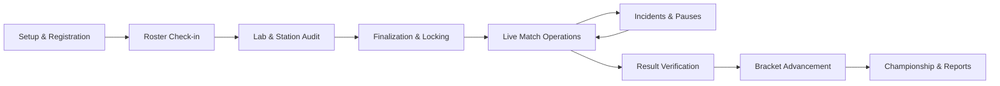

# Tournament Operations Runbook — VTO

## 1. Tournament Day Lifecycle

---

## 2. Step-by-Step Operations Guide

### Stage 1: Setup & Lab Configuration
1. Organizer creates tournament: Name, Venue, Date, Time, Format (`Single Elimination`).
2. Register Labs:
   - Lab 1: 30 PCs, 3 Stations (PCs 1–10, 11–20, 21–30).
   - Lab 2: 10 PCs, 1 Station (PCs 31–40).
3. System verifies hardware: 40 PCs operational → 4 simultaneous match stations available.

### Stage 2: Team Registration & Check-In
1. Register 13 teams with 5 players each.
2. Registration Desk Volunteer verifies physical student IDs, Riot IDs (`Name#Tag`), and marks players/teams `CHECKED_IN`.
3. Incomplete teams (e.g. 4/5 players present) flagged in orange warning state.

### Stage 3: Bracket & Fixture Generation
1. Click **Generate Bracket** → Bracket Engine calculates Size 16, 3 BYEs, places top 3 seeds into R2 automatically.
2. Click **Generate Fixtures** → Scheduling Engine distributes Round 1 matches across Lab 1 Stations 1–3 and Lab 2 Station 1.
3. Organizer reviews schedule preview, verifies zero station or team overlaps.
4. Run **Pre-Finalization Validation Pipeline** → All 10 checks PASS.
5. Click **Finalize Tournament** → System locks fixtures, brackets, and station layouts.

### Stage 4: Live Match Operations
1. Station Marshals open `/volunteer` on mobile devices.
2. Marshal taps **Call Teams** → Broadcast announcement displayed.
3. Players sit at station PCs → Marshal verifies Riot IDs, taps **Mark Ready**.
4. Both teams ready in VALORANT custom lobby (Cheats OFF, Tournament Mode ON) → Marshal taps **Start Match** (Status → `LIVE`).
5. Real-time Dashboard and Public TV screen reflect live status.

### Stage 5: Technical Incident & Pause Handling
1. PC 4 in Station 1 experiences network disconnect during Round 7.
2. Marshal immediately taps **Technical Pause** (Status → `PAUSED`).
3. Marshal logs incident: Category `NETWORK`, Severity `HIGH`, Station 1, PC 4.
4. Lab IT Technician hot-swaps ethernet cable or restores Riot client.
5. Technician marks incident `RESOLVED`.
6. Marshal taps **Resume Match** (Status → `LIVE`).

### Stage 6: Score Submission & Result Verification
1. Match ends (e.g., Team Alpha 13 - 9 Team Beta).
2. Marshal taps **Finish Match**, enters score: Team Alpha 13, Team Beta 9, submits screenshot.
3. Match transitions to `RESULT_PENDING`.
4. Head Tournament Official reviews score from Admin Desk, verifies lobby end-screen, clicks **Verify Result**.
5. System transaction updates:
   - Match status → `VERIFIED`.
   - Team Alpha advances to Round 2 slot in Bracket.
   - Station 1 released to `AVAILABLE` for next scheduled match.
   - Audit log recorded.

### Stage 7: Grand Finals & Export
1. Tournament progresses to Grand Finals.
2. Final match verified → Champion crowned.
3. Tournament status marked `COMPLETED`.
4. Organizer clicks **Export Final Tournament Report** → Downloads comprehensive PDF/CSV with full match history, team standings, incident log, and volunteer attendance.
