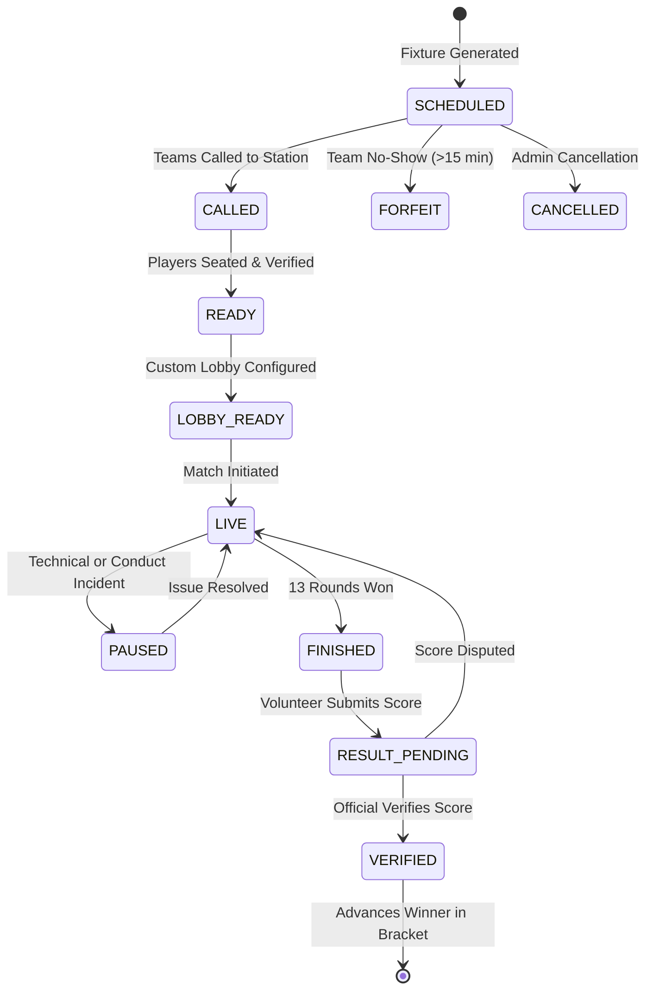

# Tournament Engine Specification — VTO

## 1. Scope & Pure Domain Layer
The Tournament Engine (`src/lib/tournament/`) is a pure TypeScript domain library with zero external UI or database dependencies. It is completely deterministic and test-driven.

---

## 2. Supported Tournament Formats

### 2.1 Single Elimination
- **Team Capacity**: Supports any arbitrary \(N \ge 2\) teams (e.g. 2, 3, 5, 7, 8, 9, 13, 15, 16, 17, 32).
- **Bracket Sizing**: Smallest power of two:
  \[
  B = 2^{\lceil \log_2 N \rceil}
  \]
- **BYE Count**:
  \[
  Y = B - N
  \]
- **Seeded Pairings**: Standard tournament seeding algorithm where Seed 1 plays Seed \(B\), Seed 2 plays Seed \(B-1\), etc. Top seeds never face each other until later rounds.
- **BYE Distribution**: Top seeds (1, 2, 3... \(Y\)) are awarded Round 1 BYEs and automatically advance to Round 2 without playing a match.
- **DAG Construction**: Matches in Round \(R\) point to target match in Round \(R+1\) with specified slot (`TEAM_A` or `TEAM_B`).

### 2.2 Round Robin (Berger Cyclic Pairing Algorithm)
- Every team plays every other team once.
- **Total Rounds**: \(N - 1\) (for even \(N\)) or \(N\) (for odd \(N\) with a dummy BYE team).
- **Total Matches**:
  \[
  M = \frac{N(N - 1)}{2}
  \]
- **Pairing Matrix**:
  - Fix Team 1, rotate the remaining \(N - 1\) teams clockwise in each successive round.
  - Alternating home/away sides to balance side selection (Attacker/Defender map advantage).
- **Standings & Tiebreaker Rules**:
  1. Match Wins (Points: 3 for standard win, 1 for overtime win, 0 for loss).
  2. Head-to-Head result between tied teams.
  3. Map / Round Differential (Total Rounds Won minus Total Rounds Lost).
  4. Total Rounds Won.
  5. Sudden-death tiebreaker match if unresolvable.

### 2.3 Group Stage + Knockout
- **Phase 1 (Groups)**:
  - Teams split into \(K\) groups (e.g. 4 groups of 4 teams).
  - Seed distribution: Snake seeding across pots (Group A: Seed 1, 8, 9, 16; Group B: Seed 2, 7, 10, 15, etc.).
  - Internal Round Robin fixtures within each group.
- **Phase 2 (Knockout Advancement)**:
  - Top 2 teams from each group qualify for an 8-team Single Elimination bracket.
  - Group A Winner plays Group B Runner-Up, Group B Winner plays Group A Runner-Up (ensures teams from the same group do not meet in the first knockout round).

---

## 3. State Machine & Invariant Matrix

### Invariants:
1. **Verified Advancements Only**: A match result can never propagate to the next round until verified by an authorized Result Official or Admin.
2. **Immutable Match Dependencies**: Predecessor match results cannot be overwritten without re-validating all subsequent dependent bracket matches and creating an audit record.
