# Tournament Engine Specification — VTO

## 1. Scope & Responsibility
The Tournament Engine (`src/lib/tournament/`) is a pure TypeScript domain library responsible for:
1. Validating tournament rules and participant configurations.
2. Generating bracket structures for Single Elimination, Round Robin, and Group Stage + Knockout formats.
3. Seeding algorithms and deterministic BYE placement.
4. Winner advancement calculation and propagation.
5. Invariant checking before and during tournament execution.

---

## 2. Supported Formats

### 2.1 Single Elimination
- **Team Capacity**: Supports any arbitrary \(N \ge 2\) teams (e.g. 3, 5, 8, 13, 16, 32).
- **Bracket Sizing**: Finds the smallest power of 2:
  \[
  B = 2^{\lceil \log_2(N) \rceil}
  \]
- **BYE Count**:
  \[
  \text{BYEs} = B - N
  \]
- **Seeded Pairings**: Standard tournament seeding algorithm where Seed 1 plays Seed \(B\), Seed 2 plays Seed \(B-1\), etc. Top seeds never face each other until later rounds.
- **BYE Distribution**: Highest seeds are awarded the BYEs in Round 1 and advance immediately to Round 2 without scheduling a physical match.

### 2.2 Round Robin
- Every team plays every other team once in a group or stage.
- Total rounds: \(N - 1\) (for even \(N\)) or \(N\) (for odd \(N\) with 1 BYE per round).
- Total matches: \(\frac{N(N - 1)}{2}\).
- Standings criteria: Matches Won > Head-to-Head > Round Difference > Total Rounds Won.

### 2.3 Group Stage + Knockout
- Teams split into \(K\) groups (e.g., 4 groups of 4).
- Internal Round Robin within each group.
- Top \(M\) teams from each group qualify for a Single Elimination knockout bracket.

---

## 3. State Transitions & Invariants

### Match State Machine

```mermaid
stateDiagram-v2
    [*] --> SCHEDULED
    SCHEDULED --> CALLED : Call teams to station
    CALLED --> READY : Both teams present at PCs
    READY --> LOBBY_READY : Custom lobby & agents set
    LOBBY_READY --> LIVE : Match begins
    LIVE --> PAUSED : Technical or conduct pause
    PAUSED --> LIVE : Resume play
    LIVE --> FINISHED : Match concludes
    FINISHED --> RESULT_PENDING : Score submitted
    RESULT_PENDING --> VERIFIED : Official verifies score
    RESULT_PENDING --> LIVE : Disputed / retry match
    SCHEDULED --> FORFEIT : Team no-show
    SCHEDULED --> CANCELLED : Admin cancellation
    VERIFIED --> [*]
    FORFEIT --> [*]
    CANCELLED --> [*]
```

### Winner Advancement Guard
- Winner advancement is **strictly blocked** until the match status reaches `VERIFIED`.
- In Single Elimination:
  - If Match \(M\) has `nextMatchId` and `nextMatchSlot`:
    - The winner of \(M\) is assigned to `nextMatchId` in the specified slot.
    - If both participants in `nextMatchId` are now known, `nextMatchId` transitions from `PENDING` to `SCHEDULED`.
- If an admin overrides a verified score, all subsequent dependent matches must be evaluated, audited, and flagged if already in progress.
