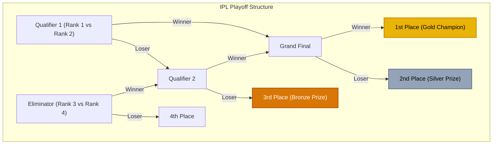
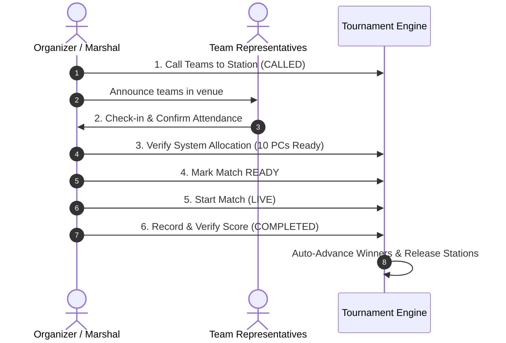

# VALORANT Tournament Operations System (VTO) — Operations & Verification Guide

## 1. Executive Summary & Scenario Confirmation

The tournament operations system has been configured and validated for your 5v5 VALORANT tournament scenario:

* **13 Teams Awaiting Match 1**:
  1. `XARAN`
  2. `Muthusipi Orchestra`
  3. `Eclipse`
  4. `Tenzor`
  5. `ESP (espada)`
  6. `Error4O4`
  7. `TEAM VORTEX`
  8. `VALORANT NOOBS`
  9. `Skull Krushers`
  10. `x`
  11. `Goodie Gang`
  12. `TEAM EREN`
  13. `Kawai`

* **Venue Infrastructure**:
  * **AI Lab**: 30 systems &rarr; **3 simultaneous match stations** (Match 1, Match 2, Match 3 &times; 10 PCs)
  * **Meta lab**: 10 systems &rarr; **1 simultaneous match station** (Match 1 &times; 10 PCs)
  * **Simultaneous Capacity**: **4 matches** (40 systems) per time slot

---

## 2. Stage 1 Slot Allocation Matrix (6 Matches + 1 BYE)

Every time slot is partitioned into distinct lab match stations. One time slot &ne; one match.

| Slot | Location | Station | Match ID | Team A | Team B | Status | Note |
| :--- | :--- | :--- | :--- | :--- | :--- | :--- | :--- |
| **Slot 1** | AI Lab | Match 1 | `M-001` | **XARAN** | **Muthusipi Orchestra** | `SCHEDULED` | 10 Systems |
| **Slot 1** | AI Lab | Match 2 | `M-002` | **Eclipse** | **Tenzor** | `SCHEDULED` | 10 Systems |
| **Slot 1** | AI Lab | Match 3 | `M-003` | **ESP (espada)** | **Error4O4** | `SCHEDULED` | 10 Systems |
| **Slot 1** | Meta lab | Match 1 | `M-004` | **TEAM VORTEX** | **VALORANT NOOBS** | `SCHEDULED` | 10 Systems |
| **Slot 2** | AI Lab | Match 1 | `M-005` | **Skull Krushers** | **x** | `SCHEDULED` | 10 Systems |
| **Slot 2** | AI Lab | Match 2 | `M-006` | **Goodie Gang** | **TEAM EREN** | `SCHEDULED` | 10 Systems |
| **Slot 2** | AI Lab | Match 3 | `M-007` | **Kawai** | &mdash; | `BYE` | Advances Automatically |
| **Slot 2** | Meta lab | Match 1 | `M-008` | &mdash; | &mdash; | `UNUSED` | Available for warmups / buffer |

> [!TIP]
> **Manual Fixture Overrides**: The organizer can swap any two teams between slots or stations, or reassign which team receives the Stage 1 BYE directly from the `/admin/fixtures` control panel using the **"Swap Teams"** and **"Set BYE"** controls.

---

## 3. Stage 2: IPL / Page Playoff System (3-Place Prize Ranks)

To determine the definitive **1st, 2nd, and 3rd place prize winners**, the system provides an **IPL / Page Playoff Bracket**:

### Prize Distribution Guarantee:
1. **1st Place (Gold Champion)**: Winner of the Grand Final.
2. **2nd Place (Silver)**: Loser of the Grand Final.
3. **3rd Place (Bronze)**: Loser of Qualifier 2 (the team eliminated right before the Grand Final).
4. **4th Place**: Loser of the Eliminator.

---

## 4. Operational Match & Attendance Flow (6 Steps)

Located at `/admin/matches` and `/volunteer`:

* **Grace Period Forfeit Handler**: If a team fails to report within the configurable grace period (default: 15 minutes), the organizer clicks **"Forfeit / No-Show"**, awarding a walkover win (`13-0`) to the opposing team and logging an immutable audit record.

---

## 5. Dynamic Hardware & Capacity Configuration

Accessible via `/admin/venues`:
* **Zero Hardcoded Limits**: Organizers can adjust PC count, PC status (`AVAILABLE`, `MAINTENANCE`, `OFFLINE`), systems per match (default: 10), slot duration (default: 60 min), and grace period (default: 15 min).
* **Live Dynamic Recalculation**:
  $$\text{Station Capacity} = \left\lfloor \frac{\text{Available Working PCs}}{10} \right\rfloor$$
  If a PC is flagged for maintenance in AI Lab, the system alerts the organizer and updates the slot scheduling capacity immediately without corrupting active brackets.

---

## 6. Access Endpoints

| Portal | URL | Purpose |
| :--- | :--- | :--- |
| **Admin Dashboard** | `http://localhost:3001/admin` | High-level status, metrics, time slot summary, and quick links |
| **Stage 1 Fixtures** | `http://localhost:3001/admin/fixtures` | Time Slot 1 & 2 cards, team swap modal, BYE selection |
| **Playoff Bracket** | `http://localhost:3001/admin/bracket` | IPL Page Playoff tree, 3-place prize podium, score recording |
| **Live Match Desk** | `http://localhost:3001/admin/matches` | 6-step attendance flow, PC station assignments, forfeit tool |
| **Venue Hardware** | `http://localhost:3001/admin/venues` | AI Lab & Meta lab PC status grid, capacity configuration |
| **Team Rosters** | `http://localhost:3001/admin/teams` | 13 teams roster, check-in badges, Stage 1 played tracking |
| **Projector View** | `http://localhost:3001/display/vto-tourney-1` | Dark-mode spectator board for LAN monitors |
| **Volunteer View** | `http://localhost:3001/volunteer` | Mobile-optimized touch interface for floor marshals |

---

## 7. Verification Recording

The browser session verifying all pages, fixtures, and bracket logic has been captured:
`file:///C:/Users/sivak/.gemini/antigravity-ide/brain/463fba57-8834-496a-8d0c-6db4d08e8b12/vto_app_demo_1790384216493.webp`
